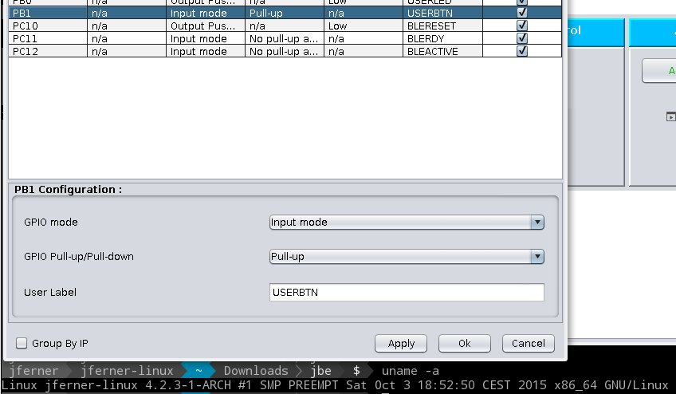

This code fixes a bug in STM32CubeMX which only appears on non-Windows platforms as described [here](https://my.st.com/e8ee2d5b)

- Install STM32CubeMX as described [here](http://fivevolt.blogspot.com/2014/07/installing-stm32cubemx-on-linux.html)
- Download [stm32cubemx-patch-1.0.jar](https://github.com/joeferner/stm32cubemx-patch/releases)
- Run the following

        STM32CUBEMXDIR=<stm32cubedir> # /opt/STM32CubeMX/
        cp ${STM32CUBEMXDIR}/plugins/ip/gpio.jar ${STM32CUBEMXDIR}/plugins/ip/gpio.jar.orig
        mkdir /tmp/gpio
        cd /tmp/gpio
        jar xf ${STM32CUBEMXDIR}/plugins/ip/gpio.jar.orig
        java -jar ~/Downloads/stm32cubemx-patch-1.0.jar /tmp/gpio
        jar cf ${STM32CUBEMXDIR}/plugins/ip/gpio.jar *

